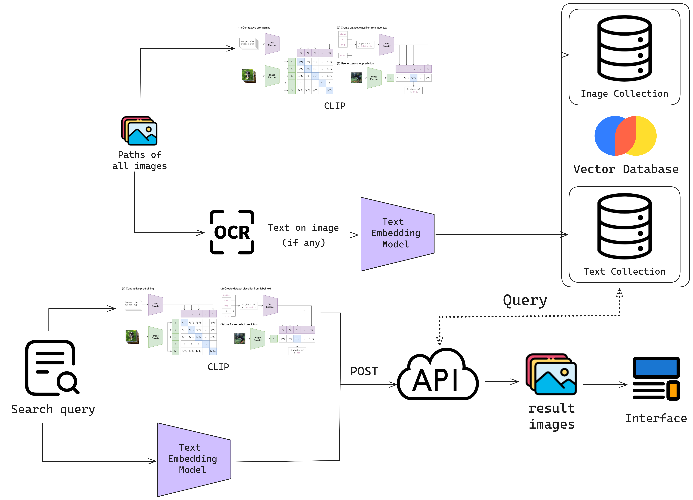

<div align = "center" >


CLIPPyX is a powerful system-wide image search and management tool that offers versatile search options to find images based on their content, text, and visual similarity. With its advanced features, you can effortlessly locate the desired images across your entire computer's disk(s), regardless of their location or file names.

----------------------------------------

</div>


🎬 [Video at 1x speed](https://x.com/0ssamaak0/status/1797373251049713827)

# Main Features
- **Search by Image Caption**: Enter descriptive text or phrases, using CLIP, CLIPPyX will return all images related to that semantic meaning or caption.

- **Search by Textual Content in Images**: Provide descriptive text or phrases, and using Optical Character Recognition (OCR) and text embedding model, CLIPPyX will return all images with text semantically similar to the provided text.

- **Search by Image Similarity**: Provide an existing image as a reference, and CLIPPyX will find visually similar images using CLIP.

# Tool Overview



- **Everything SDK**:
CLIPPyX uses [Voidtools Everything SDK](https://www.voidtools.com/support/everything/sdk/) to list the paths of all images on the system.

- **CLIP**:
[OpenAI's CLIP](https://openai.com/index/clip/) is the main component of CLIPPyX. It's to store all image embeddings in vector database to query on later.

- **OCR & Text Embedding**:
OCR is applied to all images to extract text from them, then these texts are embedded using a text embedding model and stored in a vector database to perfrom text-based search.

- **CLIPPyX Server**:
CLIPPyX server receives the search query from the UI, then it queries the collections of image embeddings and text embeddings to return the relevant images.

# Getting Started
## Basic Installation
- Install & Run [Everything](https://www.voidtools.com/) in your Windows machine
- Install in your env[Pytorch](https://pytorch.org/)
- Clone the repository
- in the root directory, run the command

```
pip install -e .
```
- to start CLIPPyX server, run 
```
CLIPPyX
```

After some automatic downloads (Everything SDK, Models from 🤗 Transformers), you should see the indexing process starting. Then the server will be ready to receive search queries.

```
 * Serving Flask app 'server'
 * Debug mode: off
INFO:werkzeug:WARNING: This is a development server. Do not use it in a production deployment. Use a production WSGI server instead.
 * Running on all addresses (0.0.0.0)
 * Running on http://127.0.0.1:23107
 * Running on http://172.25.97.13:23107
 ```

you can check the server is running be sending a simple request to the server using CURL or Postman.

```
curl -X POST -H "Content-Type: application/json" -d "{\"text\": \"Enter your query here\"}" http://localhost:23107/clip_text
```
## Alternative Models
For more memory efficient and faster indexing and search, there're alternative for both `CLIP` and `Text Embedding` models

- [Using Apple's Mobile CLIP](https://github.com/0ssamaak0/CLIPPyX/tree/main/CLIP)
- [Using GGUF from llama.cpp](https://github.com/0ssamaak0/CLIPPyX/tree/main/text_embeddings)

## Running CLIPPyX server in WSL
Getting the Paths of all images must be done in **Windows** to run `Everything SDK`, However, running the server itself in **WSL** is a good alternative, especially when using [Alternative Models](#alternative-models) due some issues or complex setup process on **Windows**

- Assuming you already have **WSL** installed, in a new environment, follow the [same installation steps](#basic-installation) (don't start the server)
- in `config.yaml` change `server_os` to `wsl`
- in `server_wsl.sh` add path to your WSL python environmen (example provided)
- in your **Windows** powershell or command prompt , run `CLIPPyX` command. This will use Everything SDK in Windows, then start the server in **WSL**.

# User Interface
Having CLIPPyX server running, you can use any UI capable of sending HTTP requests to the server, you can customize any UI to do this, or use one of the provided UIs.

Check [UI page](https://github.com/0ssamaak0/CLIPPyX/tree/main/UI) to check available options.


# Future Work
Check [Issues](https://github.com/0ssamaak0/CLIPPyX/issues) for future work and contributions. don't hesitate to open a new issue for any feature request or bug report.