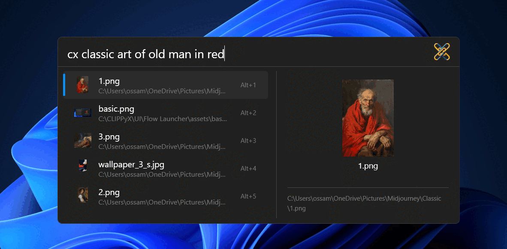

# CLIPPyX Flow Launcher Plugin

# Installation
- install [Flow Launcher from official website](https://www.flowlauncher.com/#)
- download the plugin zip file
- unzip the file in `FlowLauncher\Plugins` directory (usually in `AppData\Roaming`)
- Restart Flow Launcher, you should see `CLIPPyX` in list of plugins
- It's suggested to turn on `Always preview` in Flow Launcher sett's to see the images

# Using the Plugin
to trigger CLIPPyX plugin, type `cx` in the bar

- **Search by Image Caption**: write your serach query directly

- **Search by Textual Content in Images**: after `cx` write `|` then enter your query

- **Search by Image Similarity**: after `cx` write `#` then enter the path of your image (you can select the image and press `Win + Shift + C` to get the path)