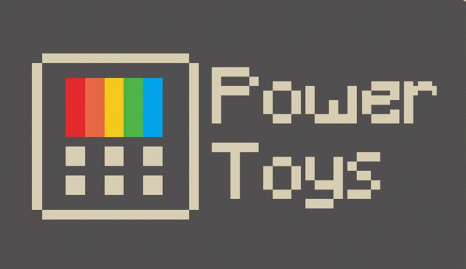
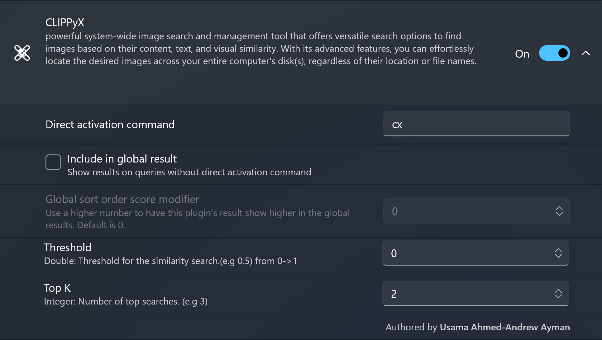

# CLIPPyX PowerToys Run Plugin

# Installation
- Install [PowerToys from official MicrosoftStore](https://apps.microsoft.com/detail/xp89dcgq3k6vld?hl=en-US&gl=US)
- Exit PowerToys
- Download the zip file and unzip
- Copy the dll files with plugin.json and Images dir in `%LocalAppData%\Microsoft\PowerToys\PowerToys Run\Plugins\CLIPPyX Powertoys Plugin` directory (usually in `AppData\Local`) (if `CLIPPyX Powertoys Plugin` doesn't exist, create it)
- Start PowerToys, you should see `CLIPPyX` in list of plugins in PowerToys Run

# Build
- Install [.Net8 from the official website](https://dotnet.microsoft.com/en-us/download/dotnet/thank-you/sdk-8.0.401-windows-x64-installer) 

- Open powershell inside the unzipped directory and enter: `dotnet build -c release`
- Exit PowerToys
- Copy `.\bin\Release\net8.0-windows\*` in `%LocalAppData%\Microsoft\PowerToys\PowerToys Run\Plugins\CLIPPyX Powertoys Plugin` directory (usually in `AppData\Local`) (if `CLIPPyX Powertoys Plugin` doesn't exist, create it)
- Don't copy any `PowerToys*`, `Wox*` .dll (They are auto included because they are version specific)

# Using the Plugin
to trigger PowerToys Run press `alt+Space` 
to use CLIPPyX plugin, type `cx` in the bar

- **Search by Image Caption**: write your serach query directly

- **Search by Textual Content in Images**: after `cx` write `|` then enter your query

- **Search by Image Similarity**: after `cx` write `#` then enter the path of your image (local path or url)

# Resources
- [Creating custom PowerToys Run plugins
](https://conductofcode.io/post/creating-custom-powertoys-run-plugins/?ref=dailydev)