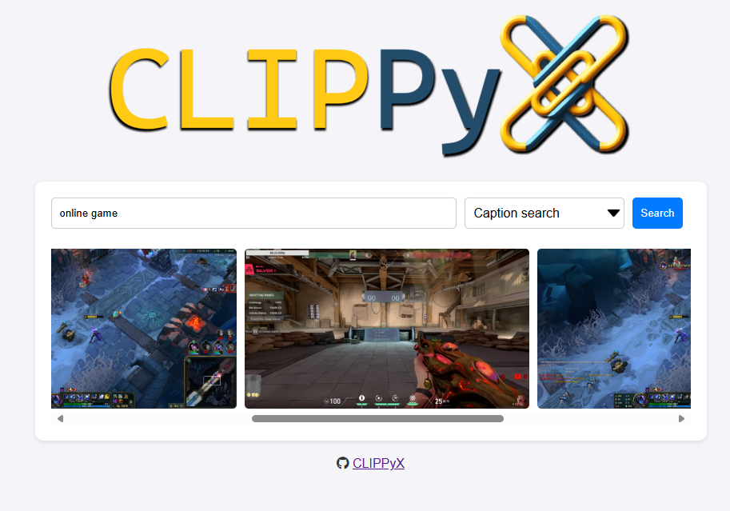
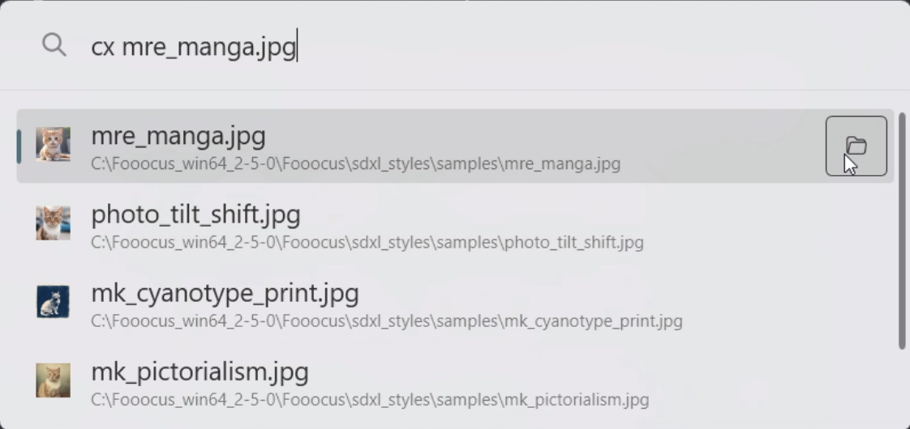

# Available UIs

## CLIPPyX Web UI

Simplest UI to interact with CLIPPyX server, it's a web interface that sends search queries to the server and displays the results.

## Flow Launcher Plugin

Better Option, easy access from anywhere in the system. Just type `cx` in the Flow Launcher search bar and start searching.

## PowerToys Run Plugin 

A versatile and powerful option for Windows users. Integrates seamlessly with PowerToys Run, allowing you to quickly search and interact with the CLIPPyX server directly from your desktop. Just type `cx` followed by your query in the PowerToys Run search bar to get instant results.

